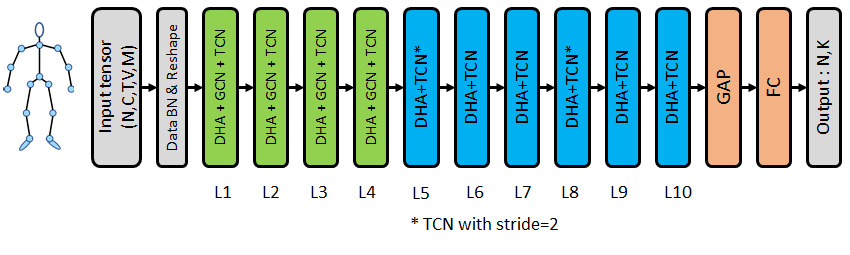
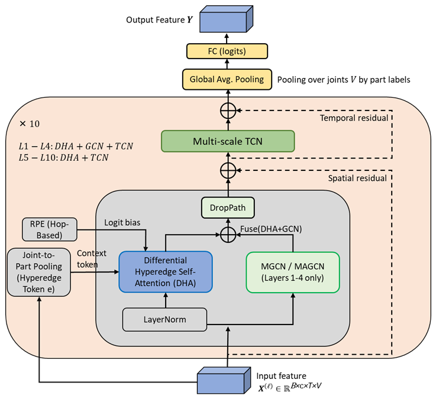
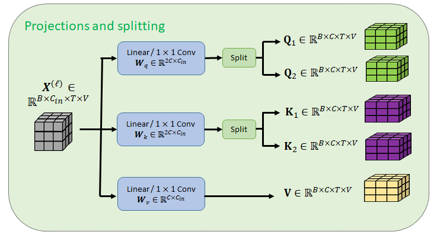
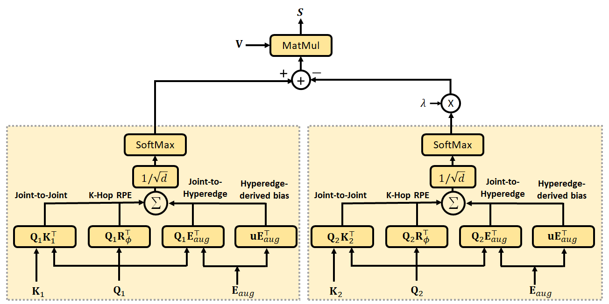
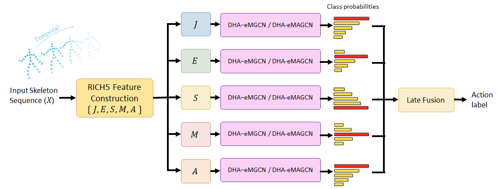
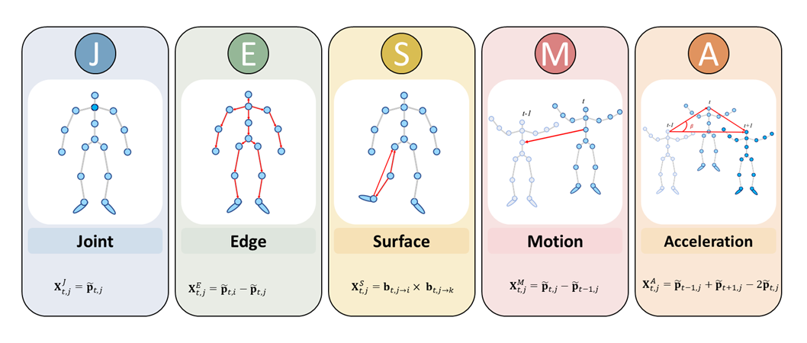

# DHA-eGCN: Differential-Hyperedge-Attention-Enhanced Graph Convolution Network for Skeleton-based Human Action Recognition

This repository provides the reference implementation of **DHA-eGCN**, a hybrid skeleton-based human action recognition framework based on [Hyperformer: Hypergraph Transformer for Skeleton-based Action Recognition](https://arxiv.org/pdf/2211.09590.pdf).

DHA-eGCN is designed to preserve the local kinematic structure of the human body while capturing long-range spatiotemporal dependencies from skeleton sequences. It combines topology-aware differential hyperedge attention, graph convolution, and multi-scale temporal convolution for robust skeleton-based action recognition.

The method is described in the accompanying manuscript:

> **DHA-eGCN: Differential-Hyperedge-Attention-Enhanced Graph Convolution Network for Skeleton-based Human Action Recognition**

## Overview

Skeleton-based human action recognition aims to classify human actions from 3D joint trajectories, usually obtained from RGB-D sensors or pose-estimation systems. However, skeleton sequences are often affected by joint noise, occlusion, missing joints, and viewpoint variations.

DHA-eGCN addresses these challenges by integrating:

- **Differential Hyperedge Attention (DHA)** for topology-aware global spatial interaction
- **Masked Graph Convolution Network (MGCN)** for stable local skeleton topology modeling
- **Masked and Adaptive Graph Convolution Network (MAGCN)** for action-conditioned spatial relation refinement
- **Multi-Scale Temporal Convolution (MSTCN)** for efficient temporal motion modeling
- **Multi-stream late fusion** using standard and enriched skeleton feature streams

## Figures

### Figure 1. Overall DHA-eGCN architecture

**Figure 1.** Overall architecture of DHA-eGCN. The network processes the input skeleton sequence through data normalization, DHA-eGCN blocks, global average pooling, and a fully connected classifier. The first four layers use DHA + GCN + TCN, while deeper layers use DHA + TCN. Temporal downsampling is applied at layers 5 and 8.

### Figure 2. DHA-eGCN block

**Figure 2.** Detailed DHA-eGCN block. The spatial module combines Differential Hyperedge Attention (DHA) with an optional MGCN or MAGCN branch. The output is then passed to a multi-scale TCN for temporal modeling. Residual connections are used in both spatial and temporal modules.

### Figure 3. Projection and splitting for differential attention

**Figure 3.** Projection and splitting process in DHA. The input feature is projected into query, key, and value tensors. The query and key projections are split into two branches, producing \(Q_1, Q_2, K_1, K_2\), while the value tensor \(V\) is shared.

### Figure 4. Two-branch Differential Hyperedge Attention

**Figure 4.** Two-branch differential attention in DHA. Each branch computes a structure-aware attention map using joint-to-joint similarity, hop-based RPE, joint-to-hyperedge interaction, and hyperedge-derived bias. The second attention map is subtracted from the first using a learnable coefficient \(\lambda\), and the result is applied to \(V\).

### Figure 5. Multi-stream RICH5 framework

**Figure 5.** Multi-stream RICH5 framework. The input skeleton sequence is decomposed into five complementary streams: Joint (J), Edge (E), Surface (S), Motion (M), and Acceleration (A). Each stream is processed by DHA-eMGCN or DHA-eMAGCN, and the final prediction is obtained by late fusion.

### Figure 6. RICH5 feature decomposition

**Figure 6.** RICH5 feature decomposition. The five skeleton feature streams represent joint coordinates, bone-edge vectors, surface or cross-product features, temporal motion differences, and acceleration-like second-order temporal differences.
## Main Idea

Given an input skeleton sequence:

$$
X \in \mathbb{R}^{N \times C \times T \times V \times M}
$$

where:

- \(N\) is the batch size,
- \(C\) is the coordinate channel,
- \(T\) is the number of frames,
- \(V\) is the number of joints,
- \(M\) is the number of persons.

DHA-eGCN performs the following steps:

1. **Input normalization and reshaping**

   The input skeleton tensor is normalized using batch normalization over person-joint channels. The person dimension is then merged into the batch dimension so that each person instance is processed independently by the backbone.

2. **Spatial modeling with DHA**

   DHA computes structure-aware attention using:
   
   - hop-distance relative positional encoding from the physical skeleton graph
   - hyperedge context tokens generated by joint-to-part pooling
   - differential attention with two attention branches to suppress shared noisy correlations

3. **Graph-enhanced spatial modeling**

   DHA-eGCN adds an explicit GCN branch to strengthen local skeletal topology modeling. Two variants are supported:

   - **DHA-eMGCN**: DHA-eGCN with Masked GCN
   - **DHA-eMAGCN**: DHA-eGCN with Masked and Adaptive GCN

4. **Temporal modeling with MSTCN**

   Multi-scale temporal convolution captures short-term and long-term motion patterns using multiple temporal branches with different receptive fields.

5. **Global pooling and classification**

   Features are globally averaged over the temporal and joint dimensions. For multi-person inputs, person-level features are averaged before the final linear classifier.

## Architecture Variants

DHA-eGCN supports two main graph convolution variants.

### DHA-eMGCN

**DHA-eMGCN** uses a masked graph convolution branch. It applies learnable edge-importance masks on top of fixed skeleton adjacency partitions.

This variant preserves the physical structure of the human skeleton while allowing the model to emphasize task-relevant edges during training.

### DHA-eMAGCN

**DHA-eMAGCN** extends DHA-eMGCN by adding a sample-adaptive adjacency term. This adaptive adjacency is estimated from the input features and blended with the masked skeleton prior through a learnable scalar gate.

This variant allows the model to capture action-conditioned relations beyond fixed physical bones.

## Graph Branch Placement

DHA-eGCN supports two graph branch placement strategies:

### Partial-GCN

The GCN branch is applied only in layers 1 to 4.

This setting emphasizes early spatial grounding while keeping deeper layers mainly attention-based.

### Full-GCN

The GCN branch is applied in all 10 layers.

This setting keeps graph-based spatial reasoning active throughout the whole backbone. In the accompanying manuscript, the full-GCN setting gives the best overall performance.

## Differential Hyperedge Attention

DHA is the main spatial attention module in DHA-eGCN. It combines three ideas:

### 1. Hop-based relative positional encoding

DHA uses shortest-path hop distances on the physical skeleton graph to inject topology-aware relative positional encoding into the attention logits.

This encourages attention to remain consistent with the human skeletal structure.

### 2. Hyperedge tokens via joint-to-part pooling

Joint features are pooled into body-part-level tokens, such as torso, left arm, right arm, left leg, and right leg. These part-level tokens are then broadcast back to the corresponding joints.

This provides higher-order body-part context for attention computation.

### 3. Differential attention

Instead of using a single attention map, DHA computes two structure-aware attention maps and subtracts the second one from the first one using a learnable coefficient.

This design is intended to suppress shared noisy correlations and improve attention selectivity.

## Multi-Scale Temporal Convolution

After the spatial module, DHA-eGCN applies Multi-Scale Temporal Convolution to model temporal dynamics.

The temporal module uses multiple branches with different dilation rates and pooling operations. This enables the model to capture both short-term motion details and longer-range action dynamics.

Temporal downsampling is applied at layers 5 and 8.

## Multi-Stream Setting

DHA-eGCN supports both standard and enriched skeleton input streams.

### Standard 4-stream setting

The standard four-stream setting includes:

- Joint
- Bone
- Joint Motion
- Bone Motion

### Enriched RICH4 setting

The enriched four-stream setting includes:

- **J**: Joint feature
- **E**: Edge feature
- **S**: Surface feature
- **M**: Motion feature

### Enriched RICH5 setting

The enriched five-stream setting includes:

- **J**: Joint feature
- **E**: Edge feature
- **S**: Surface feature
- **M**: Motion feature
- **A**: Acceleration-like feature

Each stream can be processed by either DHA-eMGCN or DHA-eMAGCN. The final prediction is obtained by late fusion using a weighted sum of per-stream class probabilities.

## Difference from the Original Hyperformer

This code is derived from the original Hyperformer implementation, but introduces several major changes.

### 1. Differential Hyperedge Attention

The original Hyperformer attention is extended into a two-branch differential attention mechanism. The final attention map is obtained by subtracting one attention branch from another using a learnable coefficient.

This is designed to reduce noisy or redundant attention responses.

### 2. Explicit GCN Branch

DHA-eGCN adds an explicit graph convolution branch to complement global attention with local skeleton topology modeling.

The graph branch can be used in either partial-GCN or full-GCN mode.

### 3. MGCN and MAGCN Variants

Two graph-enhanced variants are implemented:

- **DHA-eMGCN**: masked fixed-topology GCN
- **DHA-eMAGCN**: masked plus adaptive GCN

### 4. Full-depth Graph Modeling

In addition to the partial-GCN setting, this repository supports the full-GCN setting, where the graph branch is applied to all ten backbone layers.

### 5. Enriched Multi-Stream Input

DHA-eGCN supports enriched skeleton feature streams, including joint, edge, surface, motion, and acceleration-like representations.

### 6. Late Fusion with Stream-wise Model Selection

Different streams may use different model variants. For example, some streams may prefer DHA-eMGCN, while others may prefer DHA-eMAGCN.

This allows stream-specific model selection before late fusion.

## Training Setting

The typical training configuration for NTU RGB+D 60 follows the accompanying manuscript:

- Framework: PyTorch
- Dataset: NTU RGB+D 60
- Protocols: X-Sub and X-View
- Epochs: 140
- Loss: Cross-entropy
- Initial learning rate: 0.025
- Learning rate decay: 0.1 at epochs 110 and 120
- Batch size: 32
- Input sequence length: 64 frames
- Backbone depth: 10 layers
- Temporal downsampling: layers 5 and 8

## Experimental Results

On the NTU RGB+D 60 dataset, DHA-eGCN is evaluated under both X-Sub and X-View protocols.

According to the accompanying manuscript, the optimized full-GCN multi-model ensemble achieves:

| Method | Stream Setting | X-Sub Top-1 | X-View Top-1 |
|---|---:|---:|---:|
| DHA-eGCN full-GCN | RICH4 | 93.7% | 97.0% |
| DHA-eGCN full-GCN | RICH5 | 93.7% | 97.0% |

The best single-model setting is full-GCN DHA-eMAGCN with RICH5, which achieves strong performance while showing that full-depth graph modeling and enriched skeletal representations are complementary.

