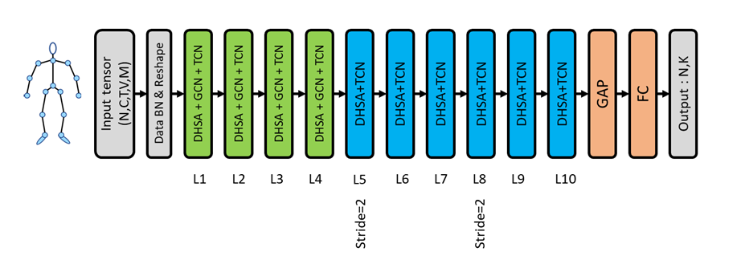
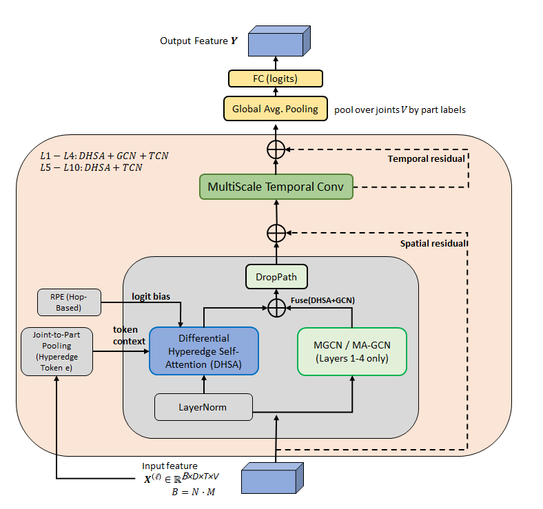
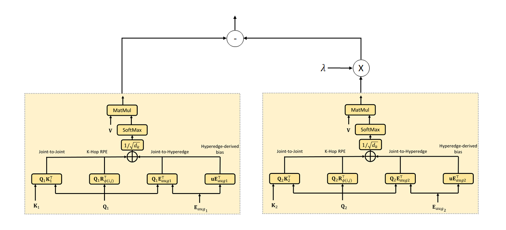
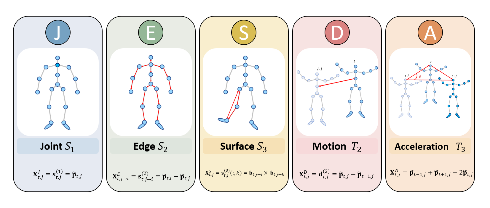

# DA-HGNet : Differential-Attention Hyperedge Graph Network

This code is based on Hyperformer  [Hypergraph Transformer for Skeleton-based Action Recognition.](https://arxiv.org/pdf/2211.09590.pdf). We made modifications for DA-HGNet.
This repository contains the reference implementation of **DA-HGNet**, a hybrid skeleton-based action recognition model that combines:

- **Differential Hyperedge Self-Attention (DHSA)** for topology-aware global spatial interaction
- **Multi-Scale Temporal Convolution (MultiScale-TCN)** for efficient temporal modeling

## Figures

### Figure 1. Overall framework

### Figure 2. DA-HGNet block and DHSA components

### Figure 3. Two-branch differential attention in DHSA

### Figure 4. Enriched five-stream (RICH5) decomposition for skeleton-based action recognition

## Main idea (high level)

Given an input sequence of 3D skeleton joints \(X \in \mathbb{R}^{N\times C\times T\times V\times M}\), DA-HGNet:
1. Normalizes and reshapes the input so each person instance is processed as an independent sample in the backbone (\(B=N\cdot M\)).
2. Applies **DHSA** to compute structure-aware attention with:
   - hop-distance RPE from the physical skeleton graph
   - hyperedge context tokens from joint-to-part pooling
   - differential attention (two attention branches combined by subtraction) to suppress shared noisy correlations
3. Uses **MultiScale-TCN** to aggregate motion patterns over time with multiple dilated temporal branches.
4. Pools features globally and averages over persons for classification.

## Modifications / Changes from upstream (Hyperformer)

DA-HGNet is derived from the Hyperformer codebase, but differs in several key aspects:

1. **Differential attention in the spatial self-attention**
   - Replace the single attention map with a **two-branch attention** design.
   - The final attention response is formed by subtracting the second branch from the first using a learnable coefficient (noise-canceling behavior).

2. **Differential Hyperedge Self-Attention (DHSA) formulation**
   - Keep **hop-based RPE** and **hyperedge-token interactions** (joint-to-part pooling), but integrate them into both attention branches consistently.
   - Use a unified DHSA description aligned with Section 3 of the manuscript (Figures 2–3).

3. **Two variants GCN**   
   - Two variants are supported:
     - **DA-HGNet-MGCN**: masked (edge-importance) topology over a fixed K-partition adjacency
     - **DA-HGNet-MA-GCN**: masked topology + **sample-adaptive adjacency** blended with a learnable scalar gate

4. **Spatial fusion policy**
   - In Layers 1–10, DHSA and GCN outputs are fused by **summation** inside the spatial sub-layer before DropPath and residual addition.   

5. **RICH5 input decomposition support (J/E/S/D/A)**
   - In addition to classic 4-stream settings, DA-HGNet supports the enriched five-stream decomposition:
     - **J**: joint coordinates (root-normalized)
     - **E**: edge/bone vectors
     - **S**: surface (cross-product) features
     - **D**: motion (temporal difference)
     - **A**: acceleration-like (second temporal difference)
   - Late fusion is implemented as a weighted sum of per-stream class probabilities.

6. **Engineering updates for stability and reproducibility**
   - Minor refactoring and device-safe buffers (e.g., hop-distance tensor handling) to improve training stability and reproducibility across environments.

## Multi-stream setting (RICH5)

DA-HGNet supports both:
- Standard 4-stream: Joint, Bone, Joint Motion, Bone Motion
- Enriched 4-stream (RICH5): **J/E/S/D** (Joint, Edge, Surface, Motion)
- Enriched 5-stream (RICH5): **J/E/S/D/A** (Joint, Edge, Surface, Motion, Acceleration)

Each stream can be trained with either DA-HGNet-MGCN or DA-HGNet-MA-GCN, and combined by late fusion (weighted sum of per-stream class probabilities).

## Training (NTU RGB+D 60, typical)

- Framework: PyTorch
- Epochs: 140
- Loss: cross-entropy
- Base LR: 0.025, decayed by 0.1 at epochs 110 and 120
- Batch size: 32
- Temporal length: sequences resized to 64 frames

(These settings match the configuration used in the accompanying manuscript and config files.)

## Citation

If you use DA-HGNet in your research, please cite the associated paper (manuscript) and the relevant baselines used in your experiments.
